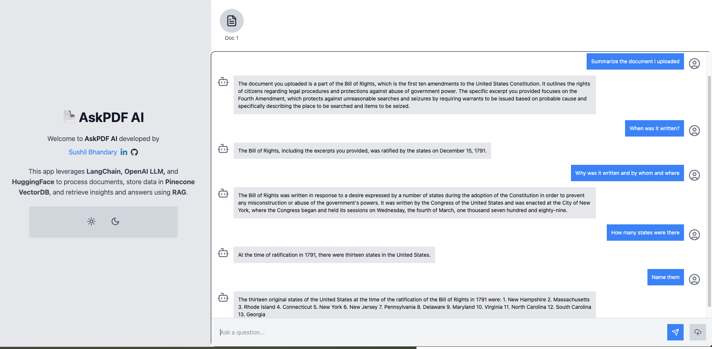

# AskPDF-AI Frontend

AskPDF-AI is an advanced Generative AI-powered application designed to process PDF documents and provide accurate answers to questions based on the content within the PDFs. The frontend of this application is built using **React, Vite, ShadCN UI, and Tailwind CSS** for an optimized and responsive user experience.

You can ask questions about PDFs using **natural language**, and the app will provide relevant responses based on the document's content. This application utilizes **FastAPI in the backend** and follows a **complete CI/CD pipeline** with **Docker and AWS Fargate**.

---

## How It Works


The **LangChain-based** backend follows these steps to provide responses to your questions:

1. **PDF Loading**: The app reads multiple PDF documents and extracts their text content.
2. **Text Chunking**: The extracted text is divided into smaller, manageable chunks.
3. **Vector Embeddings**: The application generates vector representations (embeddings) for the text chunks.
4. **Similarity Matching**: When you ask a question, the app compares it with the text chunks and identifies the most semantically similar ones.
5. **Response Generation**: The relevant text chunks are passed to a language model to generate an accurate response.

---

## Application UI

Below is a preview of the **AskPDF-AI** user interface:




---

## Frontend Tech Stack

The **frontend** of AskPDF-AI is built with:

- **React + Vite**: For a fast and modular web application.
- **ShadCN UI**: For consistent and modern UI components.
- **Tailwind CSS**: For efficient styling.

---

## Installation and Setup

### 1. Clone the Repository
To get started, clone the repository and navigate into the project directory:
```sh
git clone https://github.com/sushilrajeeva/AskPDF-AI_Frontend.git
cd AskPDF-AI_Frontend
```


### 2. Install Dependencies
Install the dependencies
```sh
npm install
```

### 3. Configure Environment Variables
Create a .env file in the root directory and add:
```sh
VITE_API_URL=http://your-backend-domain.com  # Update this with the backend API URL

```

### 3. Run the Frontend Locally
```sh
npm run dev

```

The application will be available at http://localhost:5173

## 🛠️ ShadCN UI Setup

This project uses ShadCN UI for modern and accessible UI components. You can refer to the ShadCN documentation for further customization and additional components.

To install additional components:

```sh
npx shadcn-ui@latest add button input
```

## 🐳 Docker Setup

This project is containerized using Docker for easy deployment.

### 1. Pull the Frontend Docker Image

```sh
docker pull sushilrajeev/ask-pdf-frontend:latest  
```

### 2. Run the Frontend Container

```sh
docker run -p 80:80 -e VITE_API_URL="http://your-backend-domain.com" sushilrajeev/ask-pdf-frontend:latest

```

## CI/CD Pipeline

I have implemented a fully automated CI/CD pipeline using GitHub Actions, DockerHub, and AWS Fargate

### 1. CI - Continuous Integration

- On each push to main, the frontend image is built and pushed to DockerHub.
- The previous image is deleted to save space.


### 2. CD - Continuous Deployment

- Once the image is uploaded, the deployment process is triggered.
- The latest Docker image is pulled and a new task is deployed on AWS Fargate.
- This ensures zero-downtime and automated scaling.

## Backend Setup

For the backend setup, please refer to the repository: 👉 AskPDF-AI Backend Repository (https://github.com/sushilrajeeva/AskPDF-AI_Backend)
This repository contains instructions on how to:

### 1. Setup up FastAPI and installing necessary dependencies

### 2. Deploy the backend using Docker and AWS Fargate

## 📜 License
-------
The AskPDF-AI Chat App is released under the [MIT License](https://opensource.org/licenses/MIT).